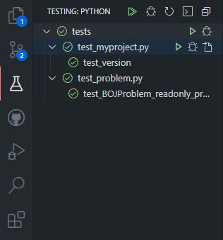

# 이 프로젝트에 참여하기

본 프로젝트에 참여하는 방법으로는 다음의 두 가지가 있습니다:

1.  **Issue 작성을 통해 참여**:
    -   GitHub의 Issue 기능을 이용하여 \[기능 추가 / 기능 개선/ 버그 수정] 등을 요청 할 수 있습니다.
    -   양식에 제한은 없으니, 자유롭게 작성해주시면 됩니다.
2.  **Pull Request를 통한 참여**:
    -   본 레포지토리를 Fork 하여 직접 기능을 수정하고,
        유닛테스트를 마친 후, 이상이 없다면 Pull Request를 보내시면 됩니다.

## 개발환경 구축

시작하기 전에:

-   이 프로젝트는 Docker를 지원합니다.
      <sup>
      \[1] [Dockerfile](.devcontainer/Dockerfile)
      </sup>

-   이 프로젝트는
    [Visual Studio Code](https://code.visualstudio.com/)
    에디터에 특화되어 있습니다.

-   이 프로젝트는 `poetry`를 이용하여 관리되고 있습니다.
    <sup>
    \[2] [official site](https://python-poetry.org/)
    </sup>

### Poetry를 이용한 개발환경 구축

`poetry`는 Python 패키지 관리를 편리하게 해주는 모듈입니다.

`poetry`를 이용하여 모듈의 외부 의존성이나, 개발 의존성을 관리하고, 빌드 작업까지 모두 할 수 있습니다.

`poetry`를 사용하기 위해서는, 먼저 모듈을 설치해줍니다.

```bash
pip3 install poetry
```

설치가 완료되면 다음의 명령어를 입력하여 의존성 설치를 진행합니다.

```bash
poetry install
```

> `poetry`가 가상 개발환경을 생성하는 것이 싫다면,
> 다음과 같이 설정하면 됩니다.
>
> ```bash
> poetry config virtualenvs.create false
> poetry install
> ```

### Pytest를 이용한 유닛테스팅

#### 테스트 실행

`pytest`를 이용하여 유닛테스트를 실행하려면 CLI에 다음과 같이 입력합니다.

<sup>
*CLI: 커맨드 라인 인터페이스 (ex: bash, powershell, cmd, ... ect.)
</sup>

```bash
$ pytest

# 혹은

$ python3 -m pytest
```

위와 같은 방법으로 `pytest` 모듈을 실행하면,
"/tests" 디렉토리 아래에 위치한 "test_\*.py" 패턴의 파일들 안에 작성된
\`def test_\*()\` 패턴의 함수들이 일괄적으로 실행되며 테스트가 진행됩니다.

##### Visual Studio Code 용 확장

만약, Visual Studio Code를 사용중이고, Microsoft가 배포한 Python 확장
<sup>
["ms-python.python"](https://marketplace.visualstudio.com/items?itemName=ms-python.python)
</sup>
을 사용중이라면, 다음과 같이 GUI를 사용하여 쉽게 관리 할 수 있습니다.



설정 방법은 다음과 같습니다:

1.  <kbd>F1</kbd> 혹은 <kbd>ctrl</kbd>+<kbd>shift</kbd>+<kbd>P</kbd>를 눌러 명령어 팔레트를 연다.
2.  `Python: Configure Tests`를 입력한다
3.  테스트 프레임워크로 `pytest`를 선택한다
4.  테스트가 포함된 디렉토리로 `tests`를 선택한다.

#### 테스트 작성

새로운 기능을 구현 하거나 버그가 발견 될 때마다, 해당 사항에 맞는 새로운 테스트를 등록해야 합니다.

테스트는 "/tests" 디렉토리 안에 "test\_"로 시작하는 ".py" 파일을 생성하거나, 기존의 코드에 추가하여 작성하면 됩니다.

\*`pytest`의 사용법은 pytest.org의 [공식 문서](https://docs.pytest.org/en/6.2.x/)를 참고해주세요.
